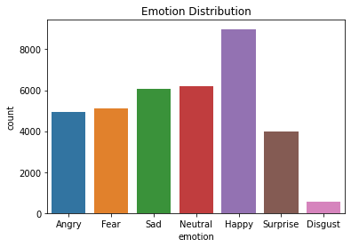
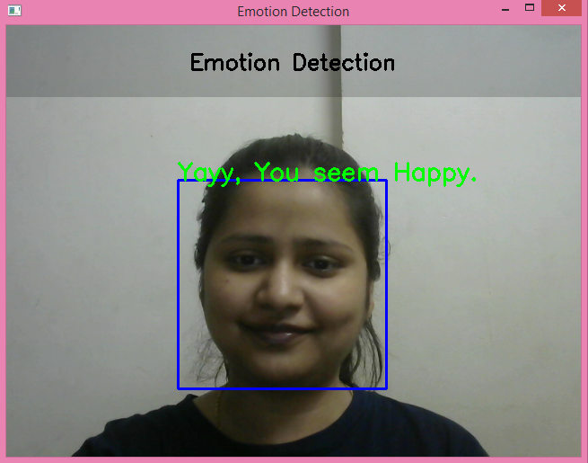
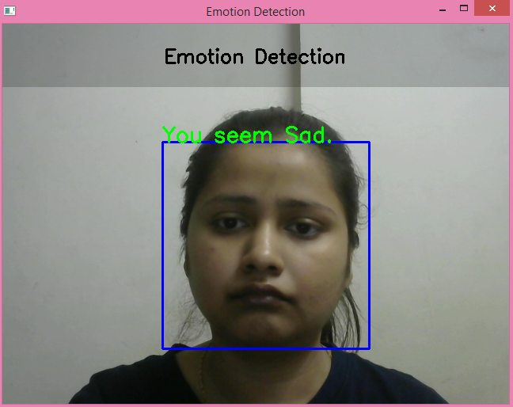
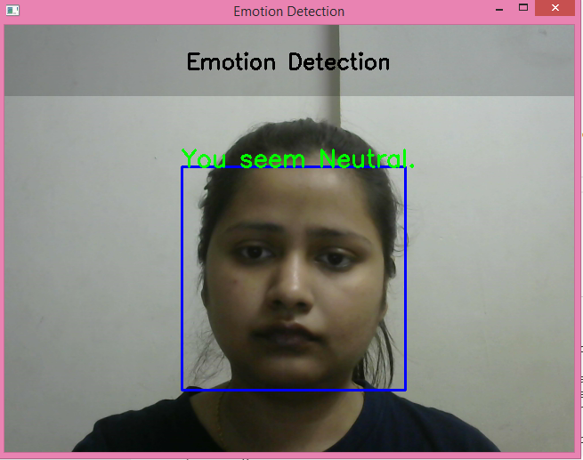
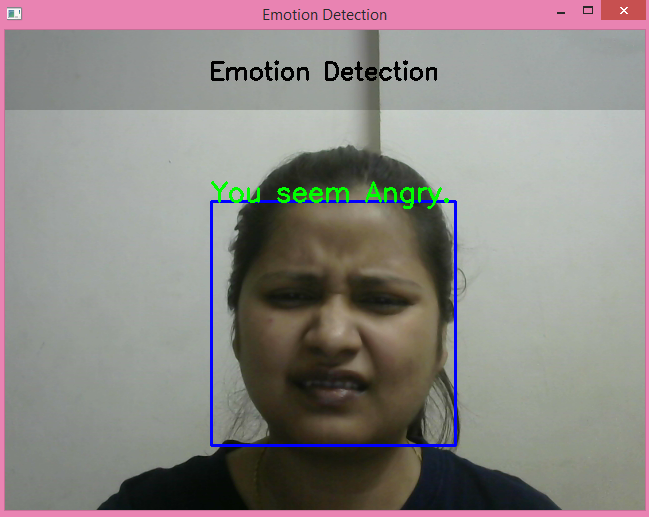
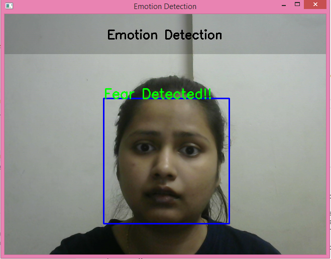
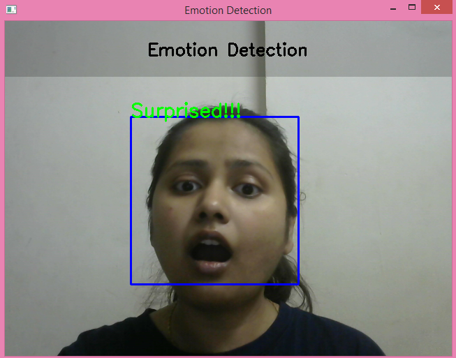

<p align="center"> 
  
</p>
<h1 align="center"> Face Emotion Recognition </h1>
<h3 align="center"> AlmaBetter Verified Project - <a href="https://www.almabetter.com/"> AlmaBetter School </a> </h5>

<p align="center"> 
</p>
<h2> Problem Statement and Project Description</h2>

<p>The Indian education landscape has been undergoing rapid changes for the past 10 years owing to the advancement of web-based learning services, specifically, eLearning platforms. Global E-learning is estimated to witness an 8X over the next 5 years to reach USD 2B in 2021. India is expected to grow with a CAGR of 44% crossing the 10M users mark in 2021. Although the market is growing on a rapid scale, there are major challenges associated with digital learning when compared with brick and mortar classrooms. One of many challenges is how to ensure quality learning for students. Digital platforms might overpower physical classrooms in terms of content quality but when it comes to understanding whether students are able to grasp the content in a live class scenario is yet an open-end challenge. In a physical classroom during a lecturing teacher can see the faces and assess the emotion of the class and tune their lecture accordingly, whether he is going fast or slow. He can identify students who need special attention. Digital classrooms are conducted via video telephony software program (exZoom) where it’s not possible for medium scale class (25-50) to see all students and access the mood. Because of this drawback, students are not focusing on content due to lack of surveillance. While digital platforms have limitations in terms of physical surveillance but it comes with the power of data and machines which can work for you. It provides data in the form of video, audio, and texts which can be analysed using deep learning algorithms. Deep learning backed system not only solves the surveillance issue, but it also removes the human bias from the system, and all information is no longer in the teacher’s brain rather translated in numbers that can be analysed and tracked. 
The solution to this problem is by recognizing facial emotions. This is a live face emotion detection system. The model is able to real-time identify the emotions of students in a live class. The demo application is developed using OpenCV-Python, CNN and Streamlit Frameworks.<p>

<h2> FER2013 Dataset </h2>
<p>The dataset used in training the CNN model for the above mentioned problem statement is FER2013 and can be downloaded from Kaggle or Data folder of the repository. The data consists of grayscale images of faces at a resolution of 48x48 pixels. The faces have been automatically registered such that they are more or less centred in each image and take up around the same amount of area. The seven categories based on the emotion expressed in the facial expression are (0=Angry, 1=Disgust, 2=Fear, 3=Happy, 4=Sad, 5=Surprise, 6=Neutral). There are 28,709 examples in the training set and 3,589 examples in the public test set.
<p>

<h2> :floppy_disk: Project Files Description</h2>

<p>This project contains three major executable files, the model output, two documentation files as well as a data directory as follows:</p>
<h4>Executable Files:</h4>
<ul>
  <li><b>Face_Emotion_Recognition_Vithika_Karan.ipynb</b> - Google Collab notebook containing data summary, exploration, visualisations and modeling.</li>
  <li><b>real_time_demo.py</b> - Local Real Time Emotion Detection through Open CV - Python.</li>
  <li><b>app.py</b> - Streamlit Web Application for Emotion Detection</li>
</ul>

<h4>Output File:</h4>
<ul>
  <li><b>emotion_detection.h5</b> - Custom CNN model trained on FER2013 Data</li>
</ul>

<h4>Documentation:</h4>
<ul>
  <li><b>Technical Documentation.pdf.pdf</b> - Includes the complete documentation about the project.</li>
  <li><b>Project Presentation- Deep Learning.pdf.pdf</b> - Presentation of the same.</li>
</ul>

<h4>Source Directory:</h4>
<ul>
  <li><b>Data</b> - Includes FER2013 data, train and validation data as well.</li>
</ul>


<h2> :book: Convolutional Neural Netwroks</h2>

<p>A Convolutional Neural Network is a Deep Learning technique that can take an input image and assign weights and biases to various objects in the image, allowing it to distinguish between them. In comparison to other classification algorithms, ConvNet requires substantially less pre-processing. While basic approaches require hand-engineering filters, ConvNets can learn these features with enough training.
</p>

<p>The convolutional layer is the most important component of a CNN because it is where the majority of the computation takes place. It requires input data, a filter, and a feature map, among other things. A feature detector, also known as a kernel or a filter, will traverse across the image's receptive fields, checking for the presence of the feature. Convolution is the term for this procedure.
</p>
<p>Pooling Layer reduces the number of parameters in the input by performing dimensionality reduction. The pooling process sweeps a filter across the entire input, similar to the convolutional layer, however this filter does not have any weights. Instead, the kernel uses an aggregation function to populate the output array from the values in the receptive field. <p>
<p>Each node in the output layer, on the other hand, connects directly to a node in the previous layer in the fully-connected layer.
This layer performs classification tasks based on the features retrieved by the previous layers and their various filters. While convolutional and pooling layers typically utilize ReLu functions to categorize inputs, FC layers typically use a softmax activation function to provide a probability from 0 to 1.
<p>


<h2> :chart_with_upwards_trend: Exploratory Data Analysis</h2>
<p>The number of happy pictures were the highest and disgusted pictures lowest in the dataset.
</p>

<h2> :chart_with_upwards_trend: Real Time Emotion Detection Results</h2>
<p>The model gave an accuracy of 0.68 on the test data which was kept aside. This indicates the model is generalizing well on unseen data as well. Here are some results of the real time test. Since the observations for disgust class were pretty low, the model is able to correctly recognize rest of the classes pretty well.<p>
<p>
            
            
            
            
            
             <p>

<h2> :clipboard: Execution Instructions</h2>
<p>The order of execution to run emotion detector locally is as follows:</p>
<p>1. Create a project folder</p>
<p>2. Create a virtual environment, for windows:</p>


```
python3 -m venv env-name
env-name\Scripts\activate.bat\
```

<p>3. Download real_time_demo.py, emotion_detection.h5 and haarcascade_frontalface_default.xml in the same folder.</p>
<p>4. Install the dependencies from requirements.txt <p>
<p>Note: Install opencv-python as well, opencv-python-headless in the requirements file is to adjust the size requirements for web app deployment purposes. To run app.py requirements.txt is enough.<p>
<p>5. Run real_time_demo.py<p>

<h2> :computer: Web Application Deployment</h2>
<p> Heroku: https://face-emo-recog1.herokuapp.com/ <p>


<!-- CREDITS -->
<h2 id="credits"> :scroll: Credits</h2>

< Vithika Karan > | Keen Learner | Business Analyst | Data Scientist | Machine Learning Enthusiast

<p> <i> Contact me for Data Science Project Collaborations</i></p>


[](https://www.linkedin.com/in/vithika-karan/)
[](https://github.com/vithika-karan)
[](https://medium.com/@vithika16k)
[](https://drive.google.com/drive/folders/1Y_MuQu-nm_EWUGiFsydd-c4EkaLeAkZi?usp=sharing)


<h2> :books: References</h2>
<ul>
  <li><p>Sumit Saha, 'Convolutional Neural Networks'. [Online].</p>
      <p>Available: https://towardsdatascience.com/a-comprehensive-guide-to-convolutional-neural-networks-the-eli5-way-3bd2b1164a53</p>
  </li>
  <li><p>Machine Learning Mastery, 'Face Detection using CNN'. [Online].</p>
      <p>Available: https://machinelearningmastery.com/how-to-perform-face-detection-with-classical-and-deep-learning-methods-in-python-with-keras/</p>
  </li>
  <li><p>GeeksforGeeks, 'Introduction to CNN'. [Online].</p>
      <p>Available: https://www.geeksforgeeks.org/introduction-convolution-neural-network/</p>
  </li>
  <li><p>Machine Learning Mastery, 'Data Augmentation'. [Online].</p>
      <p>Available: https://machinelearningmastery.com/how-to-configure-image-data-augmentation-when-training-deep-learning-neural-networks/</p>
  </li>


